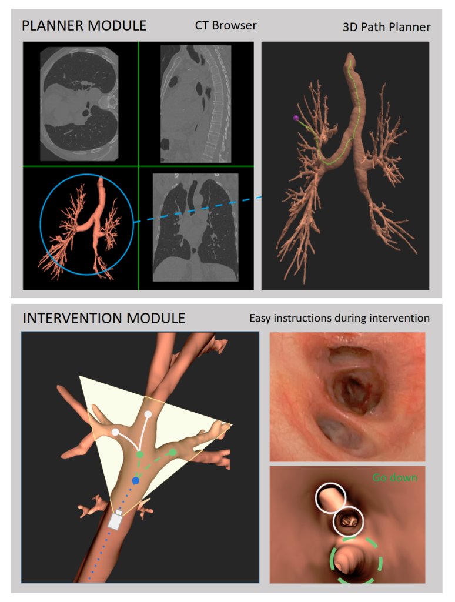

# BronchoX

BronchoX: bronchoscopy exploration software for biopsy intervention planning



## Overview
 
BronchoX is a medical imaging and virtual bronchoscopy platform designed for the analysis, visualization, and planning of pulmonary interventions from computed tomography (CT) data.
The application imports and processes medical images stored in the DICOM format, providing multi-planar visualization tools that allow clinicians and researchers to inspect anatomical structures through different viewing perspectives.
MATLAB-based processing modules generate a three-dimensional reconstruction of the bronchial tree from the input imaging data. From this 3D model, the software automatically extracts the bronchial topology and generates a navigation dataset containing the complete airway pathways.
The generated airway network can be loaded into BronchoX for interactive visualization and exploration. Users can inspect anatomical regions of interest directly on the medical images, while the application computes an optimal navigation path from the trachea to the selected target location within the bronchial tree.
Navigation routes can be reviewed step-by-step through the graphical user interface or visualized as an animated virtual bronchoscopy sequence, facilitating procedural planning and training.
In addition, BronchoX supports the export of bronchial bifurcation images along the computed pathway, enabling documentation, analysis, and reporting of the planned navigation route.
 
### Main Features
 
- Import and visualization of DICOM medical imaging studies.
- Multi-planar inspection of thoracic CT datasets.
- 3D reconstruction of the bronchial tree using MATLAB processing pipelines.
- Automatic extraction of airway topology and navigation routes.
- Interactive virtual bronchoscopy planning.
- Optimal path computation from the trachea to user-selected targets.
- Step-by-step and animated route visualization.
- Export of airway bifurcation images for documentation and analysis.
(see manual user in spanish doc/ManualUsuario.docx) 

 
## Requirements

The following software and libraries must be installed before building the project:

- Visual Studio Community 2019 or later (C++ Development Tools)
- CMake 3.21 or later
- Qt 5.13
- VTK 9.1 or later
- OpenCV
- MATLAB

---

# Installation

BronchoX is a research application developed in C++ using Qt, VTK, OpenCV, and MATLAB components.

## 1. Visual Studio Community

Download and install Visual Studio Community 2019 (or a newer version).

Make sure to include the following workload during installation:

- **Desktop development with C++**

---

## 2. MATLAB

Download and install MATLAB.

The project uses MATLAB Engine libraries and requires a valid MATLAB installation.

---

## 3. CMake

Download and install CMake version 3.21 or later.

---

## 4. Qt 5.13

Download and install Qt 5.13.

Qt is used for the graphical user interface.

---

## 5. VTK 9.1

Download VTK version 9.1 or later.

Configure and build VTK using CMake and Visual Studio.

During the CMake configuration, enable the **Advanced** view and set the following options:

```text
VTK_MODULE_ENABLE_VTK_DICOM=WANT
VTK_MODULE_ENABLE_VTK_DICOMParse=WANT
VTK_MODULE_ENABLE_VTK_vtkDICOM=WANT
VTK_GROUP_ENABLE_Qt=WANT
VTK_MODULE_ENABLE_VTK_GUISupportQt=WANT
```

Set the Qt directory:

```text
Qt5_DIR=C:/Qt/Qt5.13.2/5.13.2/msvc2017_64/lib/cmake/Qt5
```

### Known Issue

While generating the VTK project, you may encounter the following known issue:

https://gitlab.kitware.com/vtk/vtk/commit/0a90fe94

After configuration, build the **ALL_BUILD** target in Visual Studio.

This process may take several minutes.

The generated Visual Studio solution (`.sln`) can be found in the VTK build directory.

---

## 6. OpenCV

Download OpenCV.

Build the library using CMake and Visual Studio.

---

# Building BronchoX

Clone the repository:

```bash
git clone <repository-url>
```

Configure the project using CMake.

Enable **Advanced** options and set the following variables:

```text
VTK_DIR
```

Path to the VTK build directory.

```text
Qt5_DIR
```

Path to the Qt installation CMake directory.

```text
Matlab_ROOT_DIR
```

Path to the MATLAB installation directory.

Generate the Visual Studio project and build the solution.

---

# Visual Studio Configuration

Before compiling BronchoX, additional library paths must be configured.

## Debugging Environment

In:

```text
Project Properties → Debugging → Environment
```

Add the required library directories to the PATH variable.

Example:

```text
PATH=%PATH%;
D:\APP\MatLab\bin\win64;
D:\APP\VTK-9.1.1\build\bin\Debug;
D:\CVC\Project\BronchoX-exe\build\dll;
C:\Qt\Qt5.13.2\5.13.2\msvc2017_64\bin;
D:\APP\opencv\build\bin\Debug;
```

## Additional Dependencies

In:

```text
Project Properties → Linker → Input → Additional Dependencies
```

Add the following MATLAB libraries:

```text
libmex.lib
libmx.lib
libeng.lib
libmat.lib
libMatlabEngine.lib
libMatlabDataArray.lib
```

Typical location:

```text
<Matlab_ROOT>\extern\lib\win64\microsoft\
```

After configuring the dependencies:

1. Set **BronchoX** as the startup project.
2. Enable **Build before Run** in Visual Studio.

---

# Running the Application

Before running the application, resource files must be configured.

## Resource Files

Edit the file:

```text
buildResource.bat
```

Update the directory paths according to your installation and execute the script.

This will generate the required resource files.

If the script reports missing image resources, extract the ZIP file located inside the `qdarkstyle` directory.

---

## MATLAB Configuration

Verify the content of:

```text
config.json
```

and ensure that the MATLAB script directories are correctly specified.

---

# Launching BronchoX

Once all dependencies, resource files, and configuration files have been properly configured:

1. Build the project in Visual Studio.
2. Run the BronchoX startup project.

The application should start normally.

---

# Citation

If you use BronchoX in academic research, please cite the associated publications in BronchoX.bib:

## Navigation and guiding
```bibtex
@article{gil2020intraoperative,
  title={Intraoperative extraction of airways anatomy in videobronchoscopy},
  author={Gil, Debora and Esteban-Lansaque, Antonio and Borras, Agnes and Ramirez, Esmitt and Ramos, Carles Sanchez},
  journal={IEEE access},
  volume={8},
  pages={159696--159704},
  year={2020},
  publisher={IEEE}
}

@inproceedings{esteban2016stable,
  title={Stable anatomical structure tracking for video-bronchoscopy navigation},
  author={Esteban-Lansaque, Antonio and S{\'a}nchez, Carles and Borras, Agn{\'e}s and Diez-Ferrer, Marta and Rosell, Antoni and Gil, Debora},
  booktitle={Workshop on clinical image-based procedures},
  pages={18--26},
  year={2016},
  organization={Springer}
}
```

## Segmentation Method
```bibtex
@article{gil2019segmentation,
  title={Segmentation of distal airways using structural analysis},
  author={Gil, Debora and Sanchez, Carles and Borras, Agnes and Diez-Ferrer, Marta and Rosell, Antoni},
  journal={Plos one},
  volume={14},
  number={12},
  pages={e0226006},
  year={2019},
  publisher={Public Library of Science San Francisco, CA USA}
}
```

## Software
```bibtex
@article{ramirez2018bronchox,
  title={BronchoX: bronchoscopy exploration software for biopsy intervention planning},
  author={Ram{\'\i}rez, Esmitt and S{\'a}nchez, Carles and Borr{\`a}s, Agn{\'e}s and Diez-Ferrer, Marta and Rosell, Antoni and Gil, Debora},
  journal={Healthcare technology letters},
  volume={5},
  number={5},
  pages={177--182},
  year={2018},
  publisher={Wiley Online Library}
}
```